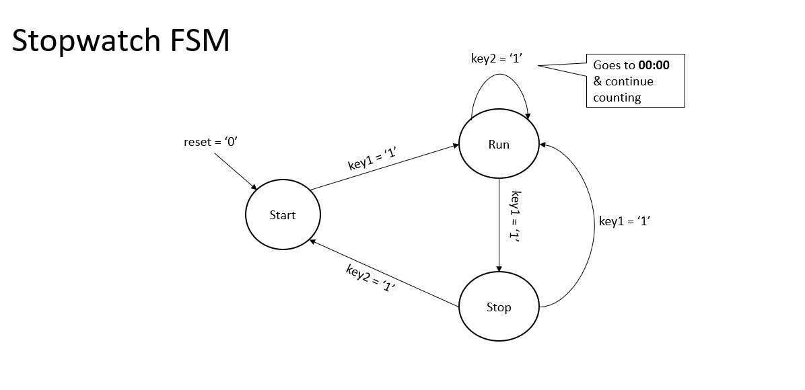
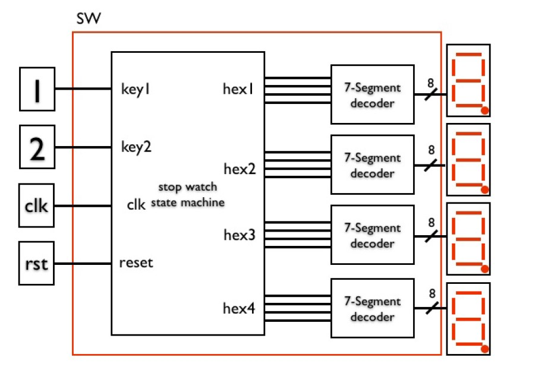

# Stopwatch
Design and implementation of Stopwatch in Spartan 3 FPGA

Stopwatch design that has two input buttons and four 8-bit outputs
connected to 7-segment displays showing minutes and seconds. The design
of the controller is implemented by the design of Finite State Machine as below.

The overall design files includes:

1. Design of seven segment decoder and test bench
2. Design of stopwatch controller and test bench
3. Push button debounce logic for stopwatch and test bench
3. Overall top level for the stopwatch design and test bench
4. Constraint file, bit file and reports.

Below is the schematic representation of the overall design.

